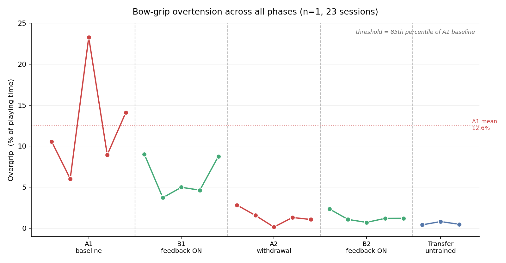

# Bow-Grip Biofeedback: An Open Wearable for Measuring Violin Bow-Hold Tension
[](https://doi.org/10.5281/zenodo.21778241)

An open-source wearable that continuously measures violin bow-grip force, forearm muscle activation, and bow motion, and can deliver real-time haptic feedback when grip exceeds a personalised threshold. Built around an ESP32 and off-the-shelf sensors for roughly ₹4,000 / ~US$50 in parts.

This repository contains the complete hardware design, firmware, logging software, experimental protocol, pre-registration, analysis code, and results of a 33-session single-subject study conducted with the device.


---

## Why this exists

Excessive bow-hold tension ("overgrip") is a widely discussed contributor to playing-related pain and injury among string players, but it is usually assessed by a teacher's eye rather than measured. This project asks whether it can be measured continuously and unobtrusively during real playing, whether haptic feedback reduces it, and whether it can be predicted before it occurs.

The study answers the first question clearly, the second one negatively, and the third one partially. All three results are reported here.

---

## Key findings (summary)

Across 33 playing sessions by a single violinist, in a pre-registered A-B-A-B reversal design with a transfer test:



| Phase | Haptic feedback | Overgrip (% of playing time) |
|---|---|---|
| A1 baseline | off | **12.6%** |
| B1 intervention | on | 6.2% |
| A2 withdrawal | off | 1.4% |
| B2 re-intervention | on | 1.3% |
| Transfer (untrained repertoire) | off | **0.6%** |

**1. Overgrip fell by roughly 95% and stayed down.** Baseline versus withdrawal, re-intervention, and transfer all show complete non-overlap (NAP = 100%, Tau = +1.00). The reduction persisted with feedback removed and generalised to repertoire the device had never been used with. Note that each phase was recorded within a single day, so these are **descriptive** comparisons across 5 testing days, not inferentially tested replicates — see [`docs/DEVIATIONS.md`](docs/DEVIATIONS.md).

**2. The design did not show that the haptic feedback caused it.** Overgrip declined monotonically with elapsed time (*r* = −0.858, *p* = 1.7 × 10⁻⁷). Adding feedback on/off to the trend model explained nothing (*p* = 0.77), and the first feedback phase was not distinguishable from baseline. A 14-day unmeasured gap between B1 and A2 contains the largest single drop (6.2% → 1.4%). Practice, measurement reactivity, proprioceptive attention from wearing the sensor, and unrecorded activity during that gap are all equally consistent with the data. **This is reported as a null result on the causal question.**

**3. Overgrip onset is weakly predictable.** A gradient-boosted model using leave-one-session-out validation reaches average precision 0.093 at the pre-registered 200–400 ms horizon — about 7× chance and 2× a grip-level baseline (ROC-AUC 0.86). But performance degrades sharply beyond 200 ms, the predictive signal comes almost entirely from grip dynamics rather than bow kinematics, and at a tolerable false-alarm rate (≤2/min) event recall is poor. Practical warning systems are not yet viable from these signals.

Full details in [`RESULTS.md`](RESULTS.md).

---

## Hardware


### Bill of materials

| Component | Notes |
|---|---|
| ESP32-WROOM-DA dev board | Any ESP32 with ADC1 pins available |
| Force-sensitive resistor (FSR) | Mounted at the thumb contact point on the bow |
| BioAmp EXG Pill (Upside Down Labs) | Surface EMG front-end; powered from **3.3 V** |
| MPU-6050 IMU | I²C, address `0x68` |
| ERM coin vibration motor, 3 V, ~10 mm | ~60–100 mA |
| IRLZ44N logic-level MOSFET | Motor driver |
| 1N4007 diode | Flyback across motor |
| Resistors | Gate resistor; FSR voltage divider |
| Gel electrodes (×3) | Disposable, for EMG |
| 3D-printed enclosure | STLs in [`hardware/`](hardware/) |

### Pin map

| Signal | ESP32 pin |
|---|---|
| FSR (thumb) | D35 |
| FSR (second channel, unused) | D34 |
| EMG output (BioAmp) | D32 |
| IMU SDA | D21 |
| IMU SCL | D22 |
| Motor gate (MOSFET) | D25 |

All analog inputs are on ADC1, which remains usable while WiFi/Bluetooth is active.

**Important:** power the BioAmp EXG Pill from the **3.3 V** rail, not 5 V. At a 3.3 V supply its output cannot exceed the ESP32's ADC range, so no level shifting or divider is required.

### Electrode placement

Two signal electrodes (IN+, IN−) on the belly of the forearm **extensor** group — the hairy, dorsal side of the bowing forearm, roughly one third of the way from elbow to wrist — spaced 2–3 cm apart along the muscle fibres. Reference electrode on a bony landmark (olecranon or wrist). Clean the skin with alcohol and mark the positions so placement is repeatable across sessions.

### Enclosure

`hardware/electronics_box_snap.stl` and `electronics_lid_snap.stl`: an 86 × 56 × 29 mm snap-fit case with 26 mm internal depth, a front window with a 3 mm frame, and two side cable slits. Print the lid plate-down for a support-free surface. Snap engagement is 0.8 mm — reduce to 0.5 mm if your printer runs tight or you print in brittle PLA.

---

## Firmware

[`firmware/logger_firmware.ino`](firmware/) samples all channels on a fixed schedule and streams CSV over USB serial at 115200 baud.

```
t_ms,fsr1,fsr2,emg,ax,ay,az,gx,gy,gz,mode
```

Two modes, switched by sending a single character over serial:

- `R` — **record**: motor disabled. Used for all baseline, withdrawal, and transfer sessions.
- `F` — **feedback**: motor driven by a two-zone ramp above the grip threshold.

The feedback curve is defined by `GRIP_THRESH` and `ZONE2_START`. **These must be derived from the individual's own baseline data, not copied from this repository.** In this study they were set to the 85th and 95th percentiles of the participant's pooled A1 grip distribution (1301 and 1584 in raw ADC units).

Dependencies: `Wire`, [`MPU6050_tockn`](https://github.com/tockn/MPU6050_tockn). The tockn library is used because many inexpensive MPU-6050 modules are clones that fail to initialise with Adafruit's driver. Note that it reports acceleration in **g**, not m/s².

The firmware targets 100 Hz. Achieved rates ranged from 21 Hz to 100 Hz depending on I²C timing; the effective rate is recoverable per session from the `t_ms` column and should be reported rather than assumed.

ESP32 Arduino core 3.x is required — the code uses `ledcAttach(pin, freq, res)` and pin-addressed `ledcWrite`, which replaced the older `ledcSetup`/`ledcAttachPin` API.

---

## Logging software

[`software/logger.py`](software/) reads the serial stream and writes one CSV per session, validating every row and reporting a live corruption rate.

```bash
pip install pyserial

# baseline / withdrawal / transfer session (motor off)
python3 logger.py S1_A1_s01.csv

# feedback session (motor on)
python3 logger.py S1_B1_s01.csv --mode F
```

Rows are rejected unless they contain exactly 11 fields with correctly typed values and a mode flag of exactly `R` or `F`. This matters: at 230400 baud this build produced intermittently garbled rows, with the mode column bleeding into adjacent values. Dropping to 115200 eliminated the corruption (0.00% rejection in all subsequent sessions), and strict validation catches anything that still slips through.

---

## Experimental protocol

[`docs/data_collection_protocol.md`](docs/) contains the full session procedure. In brief, each session ran:

1. Fixed warm-up (before logging)
2. 3 × 5 s maximum voluntary contractions (MVC), for per-session EMG normalisation
3. 30 s rest baseline holding the instrument
4. 3 × maximum grip presses (pre)
5. ~8 minutes of fixed repertoire — A minor harmonic and D major, three octaves, cycled continuously at fixed tempo and dynamic
6. 3 × maximum grip presses (post)
7. Borg CR-10 and 0–10 discomfort ratings

Held constant across all sessions: repertoire, tempo, dynamic level, time of day, warm-up, electrode positions, sensor mounting, **and bow**. Dynamic level matters particularly — if loudness varies, force spikes required by the music become indistinguishable from overgrip.

The pre-registration, written and locked before data collection, is in [`docs/pre_registration.md`](docs/).

---

## Analysis

[`analysis/`](analysis/) contains the prediction pipeline:

- `predict.py` — resampling to a uniform 50 Hz grid, IMU-based segmentation of the bowing period, overgrip onset detection, and 21-feature extraction
- `eval.py` — leave-one-session-out validation with event-level recall at a bounded false-alarm rate, plus permutation feature importance
- `lead.py` — the lead-time curve across anticipation horizons

One methodological note worth repeating: the primary outcome is the percentage of **playing** time above threshold. Early analyses that used whole-file data were inflated by the MVC clenches and maximum grip presses, which are deliberate maximal squeezes. The bowing period is segmented from IMU motion before computing the outcome.

---

## Limitations

- **Single subject.** All findings are within-individual. Nothing here establishes generality across violinists.
- **Sessions are clustered by day.** All 33 sessions fall on 7 calendar dates, with each phase run as five consecutive recordings in a single sitting. Sessions within a phase are therefore not independent observations, phase is confounded with date, and the reported effect-size statistics are optimistic. See `RESULTS.md` §8.
- **Practice and intervention are confounded.** The reversal design failed to isolate the feedback; see finding 2 above.
- **Phase is confounded with day, and sessions are pseudo-replicated.** All sessions in a phase were recorded in one afternoon minutes apart, giving 5 testing days rather than 23 independent sessions. Inferential statistics on phase comparisons are not appropriate; the comparisons are descriptive.
- **A 14-day unmeasured interval** sits between B1 and A2, spanning the largest observed change.
- **Subjective secondary outcomes were not collected.** Borg CR-10 and discomfort ratings were pre-registered but never recorded, and no session log was kept.
- **Floor censoring.** The FSR cannot distinguish very light contact from no contact — both read zero. As grip lightened over the study, an increasing share of playing fell below the sensor's activation floor (up to 57% of samples in the final session). This does not affect the overgrip metric, which counts samples above a high threshold, but median and mean grip in later sessions should be read as directional only. A fresh-sensor comparison confirmed the original FSR's low-force sensitivity had **not** degraded, ruling out sensor wear as the explanation.
- **EMG is not comparable across an electrode-setup change** partway through the study. Activation declined within each setup era, but absolute levels either side of the boundary cannot be compared.
- **One discarded run.** Five sessions were invalidated by using a different bow, which altered thumb contact geometry enough to change the grip distribution substantially. Those sessions are retained in the trend analysis as practice exposure but excluded from phase comparisons.
- **Threshold provenance.** The overgrip threshold was derived from A1 and held fixed thereafter by design, meaning later phases were scored against an early-study reference.
- **No blinding.** The participant knew which condition each session was in.

---

## What would strengthen this

The single most valuable extension is a three-arm design with additional participants: practice-only (no device), device-worn-but-inert, and device-with-feedback. That would separate motor practice, measurement reactivity, and haptic feedback — the three explanations this study cannot currently distinguish.

---

## Repository structure

```
firmware/     ESP32 Arduino sketches (logging + feedback, bench tests)
software/     Python serial logger
hardware/     Enclosure STLs, pin map, wiring notes
docs/         Pre-registration, deviations, protocol, build guide
analysis/     Prediction pipeline and validation scripts
data/         Session CSVs, incl. excluded runs (see data/README.md)
```

---

## Licence

- Code (`firmware/`, `software/`, `analysis/`): [MIT](LICENSE)
- Hardware designs (`hardware/`): CERN-OHL-P v2
- Documentation, protocol, and results (`docs/`, `README.md`, `RESULTS.md`): CC BY 4.0

---

## Credits

This project builds on the **BioAmp EXG Pill** by [Upside Down Labs](https://github.com/upsidedownlabs), an open-source biopotential front-end. Please observe their licence terms when reusing that portion of the design.

IMU support uses [MPU6050_tockn](https://github.com/tockn/MPU6050_tockn) by tockn.

---

## Citing this work

See [`CITATION.cff`](CITATION.cff), or use the DOI issued by Zenodo for the corresponding release.
